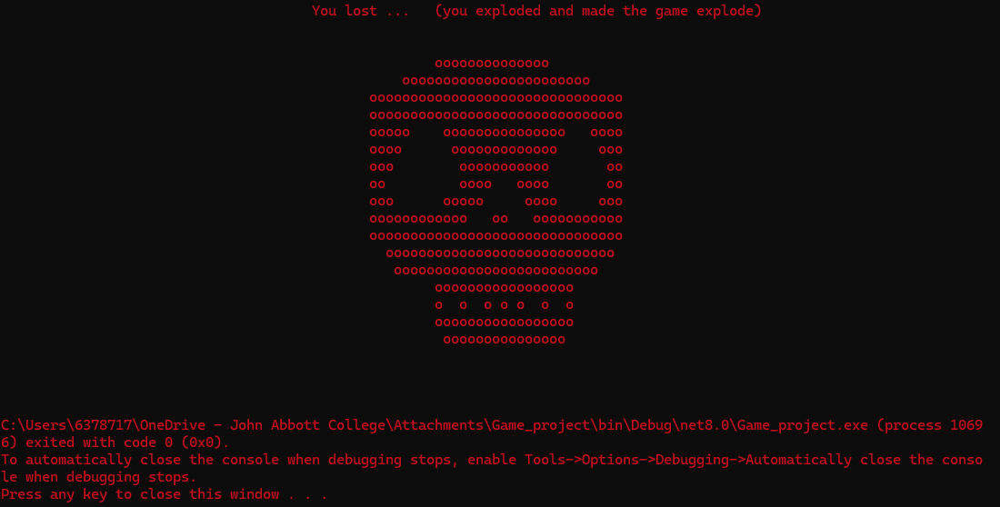
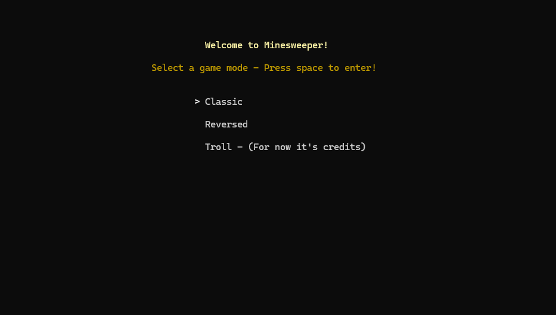
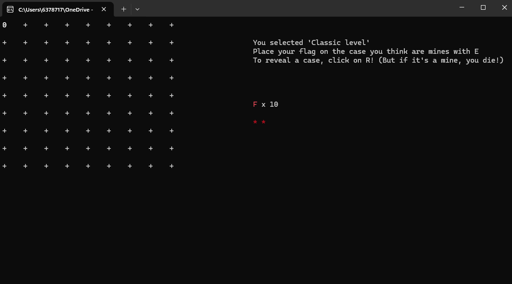
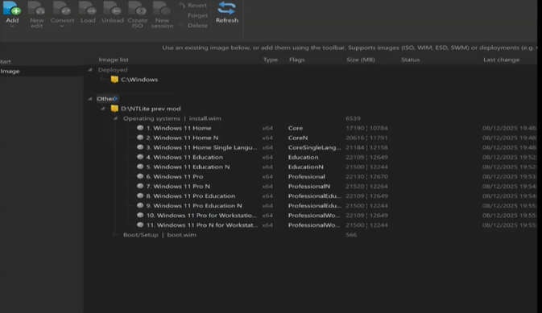
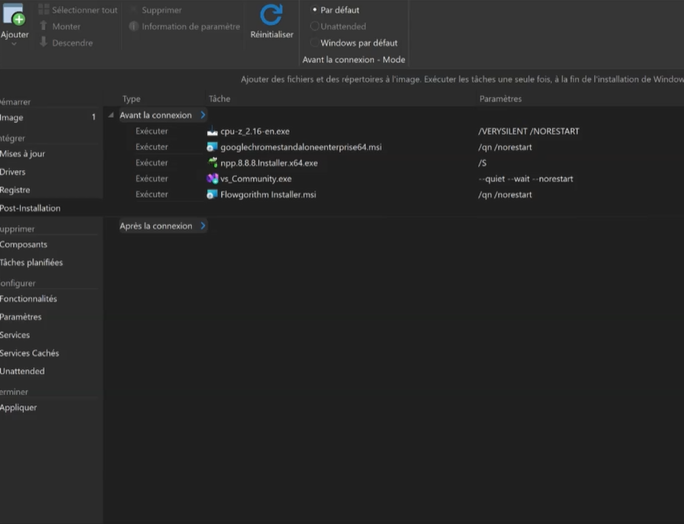
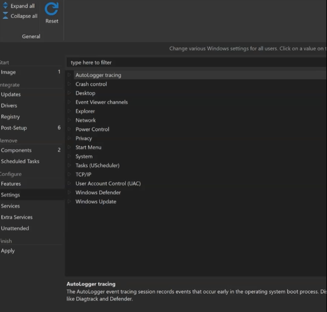

# Projects

## Programming 1 - Video Game

## Description

I created a Minesweeper game on C# with 2 different modes. The classic one as easy and a reversed where you place the mine and an algorithm will try to find them. It was a project for the end of semester 1 in John Abbott College.

## Technologies Used

* **For the whole program**: C#
* **Code snippet(s)**: .Net (On the computer console)

## Screenshots 






### Code examples:

```C#
if (flagnumber == 1)
{
    flagone.xflag = x;
    flagone.yflag = y;

    Console.SetCursorPosition(flagone.xflag, flagone.yflag);
    Console.ForegroundColor = ConsoleColor.Red;
    Console.WriteLine(flag);
    Console.ForegroundColor = ConsoleColor.White;
    xflag = flagone.xflag;
    yflag = flagone.yflag;

    numofflag--;
}
```

## What I've learnt

I've learnt how to keep data placed on the command and keep the user choice on the console. I have also learnt how to create a command able to reveal place under a character and make a foreground color to make the game well designed.

---

# Technical Support - Create a custom ISO Image

## Description

As a final project, our goal was to create a custom ISO Image using NTLite to format it. It was supposed to be developped for a fictional company so we needed to remove useless component from an original ISO Image 

> As example, we have used Windows 11 original ISO Image

## Technologies Used

* NTLite
* Virtual Machines
* Azure for Windows 11

## Screenshots 






## What I've learnt

I've learnt how to make a custom ISO Image and remove **bloatwares**. I know what is an ISO Image and how to add one inside a computer (for new OS). Technically, I know how to build a computer.

